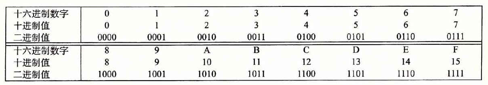
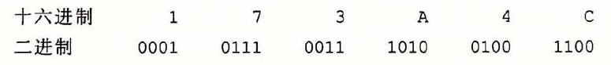

# 第二章  信息的表示和处理

## 序言

本章主要研究三种重要的数字表示。无符号（unsigned）编码，表示大于或等于0的数。补码（two's complement）编码表示有符号整数的常见方式。浮点数（floating-point）编码表示实数的科学计数法的以2为基数的版本。

理解不同的数字编码方法是必要的，因为有时候会因为溢出，舍入等问题造成结果错误。

例子：

```tex
溢出
200*300*400*500 = -884 901 888//正数乘法本不可能算出负数，但是由于溢出会造成这样的结果。

舍入（由于表示的精度有限，浮点运算是不可结合的）
(3.14+1e20)-1e20 = 0.0
3.14+(1e20-1e20) = 3.14 //因为3.14被舍入到了1e20里面了

```

## 信息存储

### 十六进制表示法



一般可以用4位二进制来表示一个十六进制的数。



十进制和十六进制的转换。

考虑十进制$ x = 314156 $的转换,反复用16除以$x$，得到商$q$和一个余数$r$，$ x=q \cdot 16 + r$，然后我们用十六进制的$r$作为最低位数字。
$314156 = 19634 \cdot 16 + 12$
$ 19634 = 1227 \cdot 16 + 2 $
$ 1227 = 76 \cdot 16 + 11 $
$ 76 = 4 \cdot 16 + 12 $
$ 4 = 0 \cdot 16 + 4 $
可以获得十六进制表示为 0x4CB2C

反过来转换为十进制则是

$12 \cdot 16^0 + 2 \cdot 16^1 + 11 \cdot 16^2 + 12 \cdot 16^3 + 4*16^4$

