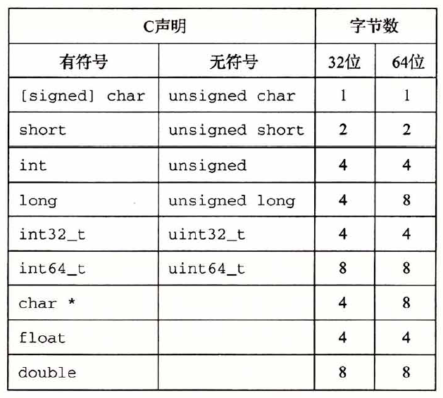
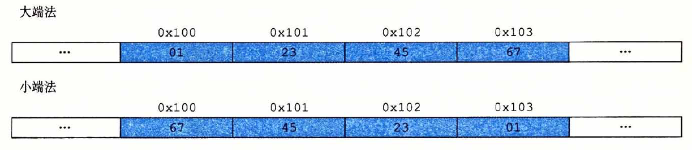
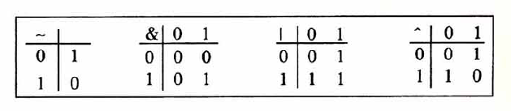

# 第二章  信息的表示和处理

## 序言

本章主要研究三种重要的数字表示。无符号（unsigned）编码，表示大于或等于0的数。补码（two's complement）编码表示有符号整数的常见方式。浮点数（floating-point）编码表示实数的科学计数法的以2为基数的版本。

理解不同的数字编码方法是必要的，因为有时候会因为溢出，舍入等问题造成结果错误。

例子：

```tex
溢出
200*300*400*500 = -884 901 888//正数乘法本不可能算出负数，但是由于溢出会造成这样的结果。

舍入（由于表示的精度有限，浮点运算是不可结合的）
(3.14+1e20)-1e20 = 0.0
3.14+(1e20-1e20) = 3.14 //因为3.14被舍入到了1e20里面了

```

**明确一些概念：**

一个**“位”**存储一位的字节码

一个**字节**由8**位**组成

**字**通常为16位，32位，64位

## 信息存储

### 十六进制表示法


一般可以用4位二进制来表示一个十六进制的数。


十进制和十六进制的转换。

考虑十进制$ x = 314156 $的转换,反复用16除以$x$，得到商$q$和一个余数$r$，$ x=q \cdot 16 + r$，然后我们用十六进制的$r$作为最低位数字。
$314156 = 19634 \cdot 16 + 12$
$ 19634 = 1227 \cdot 16 + 2 $
$ 1227 = 76 \cdot 16 + 11 $
$ 76 = 4 \cdot 16 + 12 $
$ 4 = 0 \cdot 16 + 4 $
可以获得十六进制表示为 0x4CB2C

反过来转换为十进制则是

$12 \cdot 16^0 + 2 \cdot 16^1 + 11 \cdot 16^2 + 12 \cdot 16^3 + 4*16^4 = 314156$

### 字数据大小

字长（word size）决定了虚拟地址空间的最大大小。对一个字长为$w$位的机器而言，虚拟地址空间的范围为$0 \sim 2^{w}-1$。

C语言数据类型的基本大小。



### 寻址和字节顺序

在几乎所有的机器上，多字节对象都被存储为连续的字节序列，对象的地址为所使用的最小的地址。

例如：一个int类型的变量x，它的地址为0x100。假设在一台32位的机器上，x的4个字节被存储在内存的0x100，0x101，0x102，0x103的位置上。


考虑一个$w$位的整数，其位表示为$[x_{w-1},x_{w-2},...,x_{1},x_{0}]$，其中$x_{w-1}$是最高有效位，而$x_0$是最低有效位。

假设$w$是8的倍数，这些**位**就可以被分组为字节。

其中最高有效字节包含位$[x_{w-1}, x_{w-2},...,x_{w-8}]$。

其中最低有效字节包含位$[x_{7}, x_{6},...,x_{0}]$。


从最低有效字节到最高有效字节的顺序存储对象：**小端法**

从最高有效字节到最低有效字节的顺序存储对象：**大端法**

例子：假设变量x的类型为int，位于地址0x100，它的十六进制值为0x01234567，地址范围为0x100~0x103。（每两位十六进制为一个字节，故最高有效字节为0x01，最低有效字节为0x67）



### 布尔代数简介



位向量表示有限集合。

位向量$[a_{w-1},a_{w-1},...,a_1,a_0]$编码任何子集$A\subseteq {0,1,....,w-1}$，其中$a_i=1$当且仅当$i \in A$。

例子：

位向量$a=[01101001]$表示集合$A=\left\{0,3,5,6\right\}$

位向量$b=[01010101]$表示集合$A=\left\{0,2,4,6\right\}$

布尔运算 | 和 & 对应集合的并和交，~对应集合的补。

$a\&b=[01000001]$，而$A\cap B=\left\{0,6\right\}$

### C语言中的位级运算

位级运算符：~，&，|

| C的表达式    | 二进制表达式               | 二进制结果  | 十六进制结果 |
| ------------ | -------------------------- | ----------- | ------------ |
| ~0x41        | ~[0100 0001]               | [1011 1110] | 0xBE         |
| 0x69 & 0x55  | [0110 1001]&[0101 0101]    | [0100 0001] | 0x41         |
| 0x69 \| 0x55 | [0110 1001] \| [0101 0101] | [0111 1101] | 0x7D         |

要计算十六进制的位级运算，最好的办法是先转为二进制表达，计算完成后再转回十六进制。

### C语言中的逻辑运算

逻辑运算符：!，&&，||，注意不要与位级运算混淆。逻辑运算的结果只有1和0。

位级运算只有表达式被限制为0和1时，结果才和逻辑运算一致。

逻辑运算符与位级运算符的另一个区别是，如果对第一个参数表达式求值可以确定结果的话，不会对第二个参数表达式求值。例子：a&&5/a，不会有除以0的风险，比如a=0时，a&&5已经得出结果了，后面将不会再进行。

例子

| 表达式          | 位级运算结果（自行换成位级运算符） | 逻辑运算结果 |
| --------------- | ---------------------------------- | ------------ |
| 0x69 && 0x55    | 0x41                               | 0x01         |
| 0x69 \| \| 0x55 | 0x7D                               | 0x01         |
| !0x41           | 0xBE                               | 0x00         |
| !0x00           | 0xFF                               | 0X01         |

### C语言中的移位运算

左移运算：

对于一个位表示$[x_{w-1},x_{w-2},...,x_0]$，

执行C表达式x<<k，会生成$[x_{w-k-1},x_{w-k-2},...,x_0,0,0...,0]$

从表达式可以看出，x向左移动k位，丢弃最高的k位，并在右端补k个0。

移位运算从左至右结合，x<<j<<k=(x<<j)<<k。

右移运算：x>>k

* 逻辑右移：$[x_{w-1},x_{w-2},...,x_0]$   ->   $[0,0,..,0,x_{w-1},x_{w-2},...,x_{k}]$
* 算术右移：$[x_{w-1},x_{w-2},...,x_0]$   ->   $[x_{w-1},x_{w-1},..,x_{w-1},x_{w-1},x_{w-2},...,x_{k}]$

一般来说，对符号数进行右移时，是算术右移。不同语言有不同的规定。

## 整数表示

