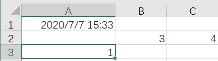

# Java操作Excel方法汇总

**1. 用workbook打开一个excel文件可以用以下方法**

```java
Workbook latestFileBook = WorkbookFactory.create(
                    new FileInputStream(PATH));
```

**2.读取sheet里面单元格的值的方法，注意区分格式。**

```java
static String getCellValue(Cell cell) {
        String cellValue = "";
        // 以下是判断数据的类型
        switch (cell.getCellType()) {
            case Cell.CELL_TYPE_NUMERIC: // 数字
                if (org.apache.poi.ss.usermodel.DateUtil.isCellDateFormatted(cell)) {
                    SimpleDateFormat sdf = new SimpleDateFormat("yyyy-MM-dd");
                    cellValue = sdf.format(org.apache.poi.ss.usermodel.DateUtil.getJavaDate(
                        cell.getNumericCellValue())).toString();
                } else {
                    DataFormatter dataFormatter = new DataFormatter();
                    cellValue = dataFormatter.formatCellValue(cell);
                }
                break;
            case Cell.CELL_TYPE_STRING: // 字符串
                cellValue = cell.getStringCellValue();
                break;
            case Cell.CELL_TYPE_BOOLEAN: // Boolean
                cellValue = cell.getBooleanCellValue() + "";
                break;
            case Cell.CELL_TYPE_FORMULA: // 公式
                cellValue = cell.getCellFormula() + "";
                break;
            case Cell.CELL_TYPE_BLANK: // 空值
                cellValue = "";
                break;
            case Cell.CELL_TYPE_ERROR: // 故障
                cellValue = "非法字符";
                break;
            default:
                cellValue = "未知类型";
                break;
        }
        return cellValue;
```

**3.关于POI中的getLastRowNum() 和getLastCellNum()以及getPhysicalNumberOfCells()和getPhysicalNumberOfRows()**



```java
getLastRowNum();//最后不为空的行的索引，该索引比行数小1。取到值为2
getLastCellNum();//最后不为空的列的索引，该索引等于列数。第二行，取到值为3
getPhysicalNumberOfRows()//不为空的行的个数。取到值为2
getPhysicalNumberOfCells()//不为空的列的个数。第二行，取到值2。
```

