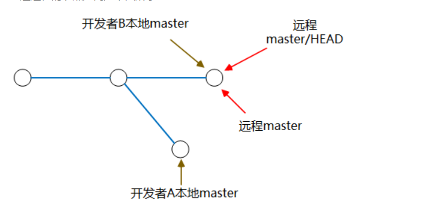
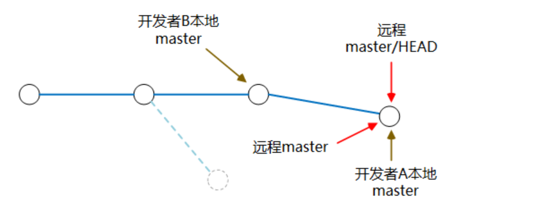
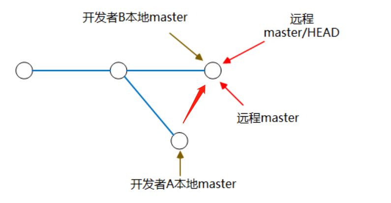

# Git常用操作

以使用如下命令从远程的origin仓库的master分支下载到本地，并新建一个temp分支

```cmake
git fetch origin master:temp
```

将temp分支和本地分支合并

```cmake
git merge temp
```

本地仓库**dev**关联远程仓库**origin/dev**

```cmake
git branch --set-upstream-to=origin/dev dev
```

关联之后可以直接用push推上远程仓库，pull拉下本地仓库


## 关于git add

git add 有几种参数，当有新建文件和删除文件的时候要注意，不然会没有提交到缓存区。

```cmake
git add -A //保存所有的修改
git add . //保存新的添加和修改，但是不包括删除
git add -u //保存修改和删除，但是不包括新建文件。
```


## 关于git rebase

​	假设在github上新建了一个项目，默认分支为master，远程master分支上readme.txt文件内容:

```tex
This is a new content!
Hello world
```

​	开发者A、B分别clone项目到自己本地进行开发。

​	某一天B提交了readme.txt，且提交成功。

```tex
This is developer B
This is a new content!
Hello dev B
```

​	之后开发者A在本地代码和远程master分支代码同步的情况下，对本地readme.txt，进行修改。

```tex
This is a new content!
Hello world
This is a developer A
```

​	修改后打算提交到远程master分支。

```tex
git add readme.txt
git commit -m "Hello Dev A"
git push
```

​	此时因为发生冲突会报错

```tex
error: failed to push some refs to 'git@git.oschina.net:XXXX/gitlearning.git'

hint: Updates were rejected because the remote contains work that you do not have locally. This is usually caused by another repository pushing to the same ref. You may want to first integrate the remote changes (e.g., 'git pull ...') before pushing again. See the 'Note about fast-forwards' in 'git push --help' for details.
```

​	我们先引入此时的节点走向图。



​	实际开发的时候，我们需要是push之前，先把远程master的分支pull下来。

```tex
git pull --rebase
```

​	要是发生冲突，会出现如下的界面

```tex
<<<<<<<<<<<<<<<<<<<head(远程分支分支号)
This is developer B
This is a new content!
Hello dev B
====================
This is a new content!
Hello world
This is a developer A
>>>>>>>>>>>>>>>>>>>>(本地分支分支号)
//这里注意一下，可能不一定上就是远程分支分支号下就是本地，具体情况具体看吧
```

​	然后解决冲突之后再进行一下操作

```tex
git add .
git rebase --continue
git push
```

​	就可以正确push到git上面了。

### 说明一下git pull --rebase以及git rebase的各种功能

```tex
git pull 
//相当于
git fetch
git merge

git pull --rebase
//相当于
git fetch
git rebase
```

​	git rebase有三个方法。

```tex
1、使用 git rebase --abort

执行之后，本地内容会回到提交之间的状态，也就是回到以前提交但没有pull是的状态，简单来说就是撤销rebase。

2、使用 git rebase --skip

git rebase --skip 引起冲突的commits会被丢弃，对于本文应用的例子来说开发者A对c.sh文件的commit无效，开发者A自己修改的部分全部无效，因此，在使用skip时请慎重。

3、使用 git rebase --continue

执行完git pull --rebase 之后，本地如果产生冲突，手动解决冲突之后，用"git add"命令去更新这些内容的索引(index)，然后只要执行:
git rebase --continue 
就可以线性的连接本地分支与远程分支，无误之后就回退出，回到主分支上。
```

​	最后分支会变成如下的样子



​	若使用的是merge，则会变成如下样子



